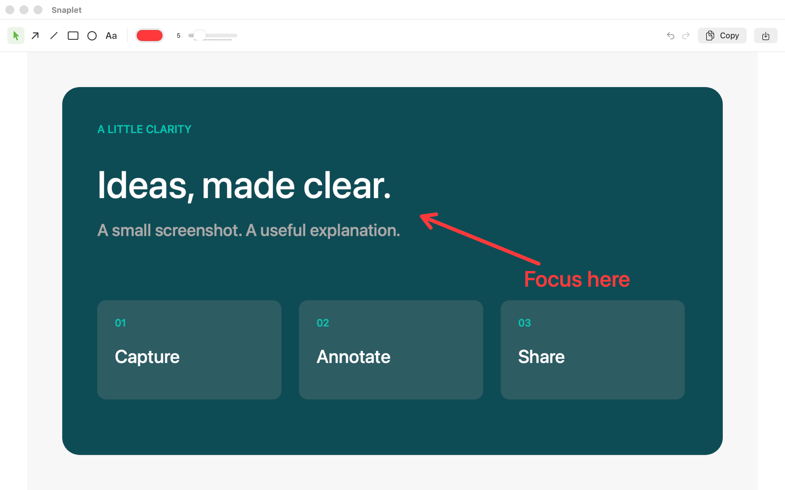

<p align="center"></p>

# Snaplet

A small, free, open-source screenshot annotator for macOS. Capture, mark, copy.

[简体中文](README.zh-CN.md) · [MIT license](LICENSE) · [Privacy](docs/PRIVACY.md)

**macOS 14 Sonoma or later · Apple silicon and Intel · Swift + AppKit + SwiftUI**



The canvas above shows a synthetic sample screenshot, with a text and arrow annotation.

## Features

- Select an area of the screen from the menu bar or with **⌘⇧2**.
- Add text, arrows, lines, rectangles, and ellipses.
- Change colors, stroke widths, and text sizes; move and resize annotations.
- Undo and redo edits.
- Copy the annotated screenshot to the clipboard or save a PNG at its original pixel resolution.
- Optional launch at login, disabled by default.

No accounts, ads, donation prompts, analytics, OCR, translation, or video recording. Screenshots stay on your Mac.

## Build and run

Install Xcode 15 or later and select it in **Xcode → Settings → Locations → Command Line Tools**. The Xcode project is checked in and has no package dependencies.

```sh
git clone https://github.com/jo9900/snaplet.git
cd snaplet
open Snaplet.xcodeproj
```

Choose the **Snaplet** scheme and **My Mac**, then Run. Select your own development team if Xcode asks for signing. For a local build without an Apple account:

```sh
./scripts/test.sh    # XCTest, ad hoc signed on your Mac
./scripts/build.sh   # Unsigned universal Release build
```

The Release app is at `build/Build/Products/Release/Snaplet.app`. Unsigned build artifacts are for local development; use Xcode signing for a stable installed app and App Store distribution.

After adding or removing source files, install [XcodeGen](https://github.com/yonaskolb/XcodeGen) and run `xcodegen generate`; the scripts do this automatically when XcodeGen is installed.

## Use

1. Launch Snaplet and click its menu bar icon, or press **⌘⇧2**.
2. Allow screen capture when macOS asks. You can change access in **System Settings → Privacy & Security → Screen & System Audio Recording** (called **Screen Recording** on older macOS versions). Relaunch if macOS requests it.
3. Drag to choose a region. **Esc** cancels capture.
4. Choose a drawing tool or add text. Select an annotation to move it, resize it, or update its style.
5. Copy the image or save it as PNG. A cancelled save keeps the editor open.

Turn on **Launch at Login** in Settings if you want Snaplet available after signing in. Keep the installed app in a stable location, such as `/Applications`, before enabling it.

The system labels screenshot permission as screen recording because both use the same permission. Snaplet only captures still images.

## Project layout

```text
Sources/Snaplet/    App, capture, annotation editor, and settings
Tests/SnapletTests/ Behavior and image-output checks
Resources/           Icon, app metadata, sandbox entitlements, privacy manifest
scripts/             Build, test, and original icon generation
docs/                Privacy policy, release preparation, manual verification
project.yml          XcodeGen source of truth
```

Regenerate the original icon with `swift scripts/generate-icon.swift` from the repository root. Its editable vector source is [Resources/Icon.svg](Resources/Icon.svg).

## Distribution

Snaplet is intended to be free on the Mac App Store. **It has not been published or submitted.** This repository includes the sandbox configuration and privacy manifest; signing, real-device checks, store metadata, and Apple review are still required. See [App Store preparation](docs/APP_STORE.md) and [manual verification](docs/TESTING.md).

Bug reports and focused pull requests are welcome. Include your macOS version, display scaling, and steps to reproduce. Avoid attaching private screenshots.
